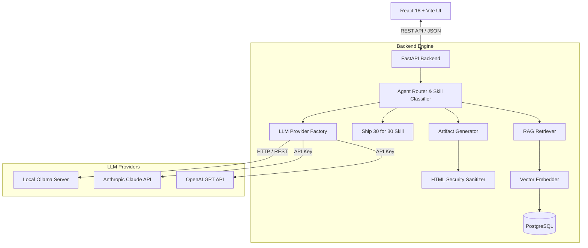

# Technical Architecture & Security Document — The Lenny Growth Assistant

## 1. System Topology & Data Flow



---

## 2. RAG Knowledge Base Architecture

### Ingestion Pipeline
1. **Source Collection**: Transcript files (`.json`, `.txt`, `.md`) are placed in `data/transcripts/`.
2. **Text Normalization & Chunking**: `chunk_text()` splits raw text into semantic units (~600 words with 100 word overlap) preserving episode titles, guest speaker names, and URLs.
3. **Dense Vector Embeddings**: `compute_embedding()` generates 384-dimensional vector representations using `sentence-transformers` (`all-MiniLM-L6-v2`) when explicitly enabled, with a deterministic 384-dimensional local vector fallback for portable demos/tests.
4. **Vector Persistence**: Chunks and embeddings are stored in the `transcript_chunks` table.

### Semantic Search & Grounded Prompting
- Query vectors are compared against chunk embeddings using cosine similarity.
- Top-k matches exceeding the minimum similarity threshold (`0.25`) are formatted into explicit context boundaries:
  ```
  --- TRANSCRIPT SOURCE [1]: Brian Chesky on 11-Star Experience Design | Speaker: Brian Chesky ---
  [Chunk text...]
  ```
- System prompts enforce strict grounding: if context is empty, the assistant returns an explicit un-grounded notification.

---

## 3. Agent and LLM Provider Abstraction

```text
LLMProvider (application abstraction)
├── OllamaProvider (required local demo path)
├── AnthropicProvider (Claude Agent SDK)
└── OpenAIProvider (cloud provider path)
```

The application-level `agent_router.py` is responsible for deterministic skill routing: grounded Q&A, Ship 30 for 30, and artifact generation. When the Anthropic provider is selected, the cloud model call is executed through the Claude Agent SDK with a one-turn, no-tool configuration. The required local demo uses Ollama and does not require an Anthropic API key.

The provider is selected through `LLM_PROVIDER`, so switching providers does not require application-code changes. Health checks expose the active provider and model.

## 4. Artifact Security Posture

### HTML Sanitization Rules
Untrusted generated HTML is filtered through `sanitize_html()` before persistence:
- **Blocked Elements**: `<script>`, `<form>`, `<input>`, `<button>`, `<textarea>`.
- **Blocked Attributes**: All inline event handlers (`onload=`, `onerror=`, `onclick=`, `onmouseover=`).
- **Blocked Protocols**: `javascript:` URIs in `href` or `src`.

### Sandboxed iFrame Isolation
HTML artifacts in the frontend are rendered using:
```html
<iframe srcdoc={artifact.sanitized_content} sandbox="allow-same-origin" />
```
- `allow-scripts` is **strictly excluded**, preventing any JavaScript execution even if an injection bypassed sanitization.
- Top-level window navigation and form submissions are blocked.
